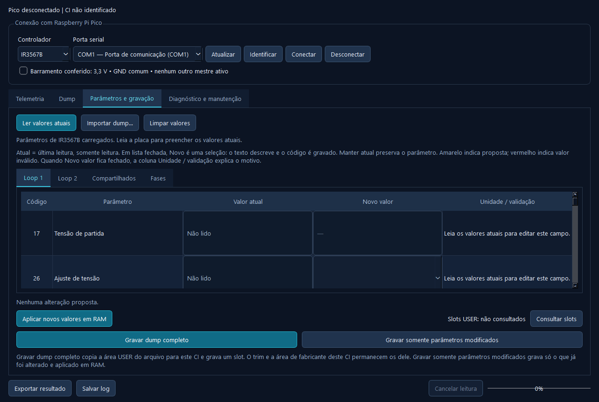

# VRM Bench — experimento de bancada

**Isto é um experimento. Não é um produto, não é uma ferramenta oficial da Infineon e não foi certificado para reparo.**

O autor deste projeto **não se responsabiliza por qualquer dano** que o uso possa causar. Isso inclui, sem se limitar a, regulador de tensão, placa de vídeo, fonte, Raspberry Pi Pico, componentes vizinhos, dados gravados na memória do CI e qualquer prejuízo direto ou indireto.

**Faça os testes em sucata.** Use uma placa que já possa ser descartada. Não ligue este conjunto a uma placa que você precise que continue funcionando. Não use em equipamento de cliente, em máquina em garantia ou em qualquer placa da qual você não aceite a perda total.

Gravar a memória permanente do controlador de tensão pode impedir a placa de ligar. Uma escrita em RAM também altera a tensão, a corrente e as proteções enquanto a placa está energizada. Uma tensão errada pode queimar a GPU, a memória ou o próprio regulador. Se você não tem como medir a saída com um multímetro antes e depois, não grave.

---

## O que é

O VRM Bench é um painel em Windows que conversa, por um Raspberry Pi Pico, com o controlador de tensão (VRM) de uma placa de vídeo usada como sucata. O Pico faz o papel de adaptador USB para o barramento I²C / PMBus. O programa no PC lê telemetria, lê o mapa de registradores e, em alguns campos, grava um byte na RAM do CI. A gravação permanente existe no programa e **gasta um slot** da memória do circuito. Ela não deve ser o primeiro teste.

A versão publicada agora é a **0.52** do programa e o firmware **0.50** do Pico (protocolo 16). Os dois precisam andar juntos. Um Pico com firmware antigo responde outro número de protocolo e o programa recusa a gravação. O par anterior, programa 0.48 e firmware 0.26 (protocolo 15), continua na pasta `release/`.



Controladores descritos hoje:

| CI | Arquivo | Uso nesta bancada |
|---|---|---|
| IR3567B (Comanche) | `aplicacao/controllers/IR3567B.json` | Placa de sucata já usada nos ensaios, PMBus 70, I²C direto 08 |
| IR35217 (Salem) | `aplicacao/controllers/IR35217.json` | Segundo mapa, mesmos endereços de barramento no JSON. Listas fechadas da faixa USER podem ser gravadas. Grandezas em mV, ampere ou frequência deste CI não foram validadas e continuam sem escrita |

O programa não identifica o CI sozinho no momento em que a porta serial abre. A pessoa escolhe o modelo. Se a leitura física não bater com o JSON escolhido, a leitura é interrompida e os valores não entram na tela.

## Pastas

| Pasta | Conteúdo |
|---|---|
| `aplicacao/` | Código Python do painel, testes, mapas JSON e amostras |
| `firmware/` | Código do Pico que implementa o protocolo 16 |
| `release/` | Pacote pronto: zip do programa para Windows e o UF2 do Pico |

Quem só vai usar a bancada, sem compilar, precisa de `release/infineon-pico-v0.50.uf2` e de `release/VRMBench-0.52-windows.zip`.

## O que você precisa

- Raspberry Pi Pico com RP2040 (não use Pico W sem conferir se o UF2 foi feito para a placa certa; este binário é da Pico clássica, `board = pico`).
- Cabo USB que transmita dados. Cabo só de carga não abre o disco de gravação nem a porta serial.
- Windows 10 ou 11 para o executável.
- Placa de vídeo **sucata**, de preferência sem GPU instalada ou já condenada, com o controlador acessível.
- Multímetro. A tela do programa não substitui a medição da tensão de saída.
- Três fios e resistores de pull-up para 3,3 V no barramento, se a placa não os tiver no trecho em que você vai ligar.
- Fonte capaz de alimentar o regulador do jeito que o esquema daquela sucata exige. O Pico **não alimenta** a placa de vídeo.

Não é obrigatório instalar Python para usar o zip. Python só entra na seção de quem for alterar o código.

## Ligações

Desligue a fonte da placa e desconecte o Pico do USB antes de mexer nos fios. Confira continuidade com a placa sem energia. Os nomes SVD e SVC da GPU **não** são SDA e SCL. O barramento deste firmware é o de configuração do controlador (SM_DIO / SM_CLK, ou os nomes equivalentes no esquema da sua placa). Não há um ponto universal numa RX 580 ou RX 5700. O boardview da sucata manda.

| Pico | Pino físico típico | Liga em |
|---|---|---|
| GP4 | 6 | SDA / SM_DIO |
| GP5 | 7 | SCL / SM_CLK |
| GND | qualquer GND, por exemplo o pino 8 | GND da placa, o mesmo terra da fonte |

Regras que já evitaram dano nesta bancada:

- Pull-ups externos em 3,3 V. O firmware **desliga** os pull-ups internos do RP2040. Sem resistor externo, o barramento não sobe.
- O GPIO do RP2040 não aceita 5 V. Não ligue SDA/SCL num barramento de 5 V.
- Não ligue 3V3, VBUS ou VSYS do Pico na alimentação da placa de vídeo.
- Não deixe outro mestre no barramento. A GPU, se ainda estiver conduzindo o I²C, briga com o Pico.
- Não conecte o sinal com a placa apagada e com pull-up ativo vindo do Pico ou de outra fonte: isso pode alimentar o CI pela linha de dados.
- Ligue e desligue os cabos com as fontes desligadas.
- Meça, com a placa energizada e o Pico ainda sem transmitir, se SDA e SCL estão em nível alto perto de 3,3 V e se o GND é comum.

Os endereços que o programa espera, para os JSON atuais, são PMBus **70** e I²C direto **08**, em 7 bits, a 100 kHz. No IR35217 o PowIRCenter mostra um segundo endereço PMBus, 71, para o loop 2. Este programa usa um endereço PMBus só, o que está no JSON.

## Instalar o firmware no Pico

O arquivo é `release/infineon-pico-v0.50.uf2`. Ele responde `OK INFINEON-PICO 16 GENERIC` ao comando `HELLO`. Protocolo 16 é o que a versão 0.52 exige para gravar um byte em RAM, copiar a área USER de um dump, recarregar a imagem permanente e gravar um slot.

Faça isto **sem** a placa de vídeo ligada no barramento.

1. Feche o VRM Bench, se estiver aberto. Ele segura a porta serial.
2. Desconecte o cabo USB do Pico.
3. Segure o botão **BOOTSEL** do Pico.
4. Ainda segurando BOOTSEL, conecte o cabo USB no computador. Solte o botão.
5. O Windows abre um disco chamado `RPI-RP2`.
6. Copie `infineon-pico-v0.50.uf2` para a raiz desse disco. Não copie para uma subpasta. Não renomeie o arquivo antes da cópia se o Windows for associá-lo a outro programa; arrastar o arquivo para o disco basta.
7. O disco some sozinho. O Pico reinicia e passa a aparecer como porta serial USB. Não é necessário ejetar.
8. Se o disco não aparecer: troque o cabo, troque a porta USB, segure BOOTSEL antes de conectar e confirme no Gerenciador de Dispositivos se algum dispositivo desconhecido surgiu. O Pico oficial não precisa de driver além do que o Windows já tem para USB serial.

Para confirmar o firmware sem a placa de vídeo:

1. Abra o VRM Bench.
2. **Atualizar** na lista de portas. A porta do Pico aparece com o nome da porta e a descrição básica, por exemplo `COM7 — Dispositivo Serial USB (COM7)`.
3. **Conectar**.
4. A barra de status deve citar o protocolo. O número tem de ser **16**. Se for menor, o UF2 gravado não é este, ou a gravação não terminou. Repita o BOOTSEL.

Identificar só lista Picos na USB. Não lê o controlador da placa de vídeo.

## Usar o programa empacotado

1. Extraia `release/VRMBench-0.52-windows.zip` para uma pasta sua, por exemplo `C:\VRMBench`. Extraia o zip inteiro. Não execute o programa de dentro do zip.
2. A pasta extraída precisa conter, lado a lado:
   - `VRMBench.exe`
   - a pasta `_internal` (bibliotecas do programa; sem ela o exe não abre)
   - a pasta `controllers` com `IR3567B.json` e `IR35217.json`
   - `LEIA-ME.txt`, com o mesmo aviso deste documento
3. Python **não** precisa estar instalado.
4. Abra `VRMBench.exe`. O Windows pode avisar que o arquivo não tem assinatura de editor. Isso é esperado num executável montado localmente. A decisão de seguir é sua.
5. Relatórios e cópias de segurança saem na pasta `captures`, criada ao lado do exe.

Não mova só o exe. Não apague `_internal` nem `controllers`.

## Usar a partir do código

Para ler o código ou alterar o programa, a pasta é `aplicacao/`. O histórico curto das versões está em `aplicacao/README.md`.

No Windows, com Python 3.11:

```text
cd aplicacao
python -m venv .venv
.venv\Scripts\python.exe -m pip install -r requirements.txt
.venv\Scripts\python.exe desktop_entry.py
```

As dependências diretas são PySide6 e pyserial (`requirements.txt`). Quem for gerar de novo o exe também instala o que está em `requirements-build.txt` e usa `VRMBench.spec` com PyInstaller. O spec deixa de fora `icuuc.dll` e `icudt78.dll` para o Qt usar o ICU do Windows.

Testes, ainda dentro de `aplicacao`, sem placa e sem Pico:

```text
.venv\Scripts\python.exe -m unittest discover -s tests
```

O modo de simulação existe no código (`use_simulation`) e não aparece na lista de interface. A janela publicada fala só com o Pico.

## Sequência segura de uso

Energize a sucata só depois dos fios conferidos. Comece sem gravar nada.

### 1. Conferir o barramento

Na faixa **Conexão com Raspberry Pi Pico**:

1. Deixe **Controlador** em `Selecione o CI` até ter certeza do modelo. Nessa opção o programa não carrega parâmetros e recusa leitura da placa, com a mensagem para escolher o CI.
2. Escolha a porta e **Conectar**. Protocolo 16.
3. Escolha o CI que está soldado na sucata. Trocar o CI no meio de uma leitura cancela o trabalho anterior, para a telemetria e apaga propostas.
4. Marque **Barramento conferido: 3,3 V • GND comum • nenhum outro mestre ativo** só depois de ter medido isso. Sem o visto, o programa não acessa o I²C.

### 2. Telemetria

Aba **Telemetria**.

- **Ler agora** pede uma amostra.
- **Iniciar monitoramento** repete a leitura no intervalo escolhido, em segundos. O monitoramento só anda com esta aba selecionada. Mudar de aba pausa a coleta automática.
- **Pausar** esquece o pedido de monitoramento. Voltar para a aba não religa sozinho.
- A barra de progresso acompanha operações longas. As amostras de telemetria não a deixam presa em 100%.
- No IR3567B desta bancada, a tensão de saída mostrada soma 50 mV à palavra Linear16, ou 56,25 mV quando o ajuste de tensão está no código de 0 mV. Isso foi ajustado para um multímetro específico. Não trate esse número como calibração universal. Meça o VCORE.
- No IR35217 essa correção de tensão **não** é aplicada. A telemetria desse JSON está reduzida de propósito.

### 3. Ler o mapa

Aba **Dump**, botão **Ler placa**, ou aba **Parâmetros e gravação**, botão **Ler valores atuais**. As duas ações leem o mapa do CI selecionado, duas vezes, e só aceitam o resultado se as duas passagens forem iguais.

O programa compara os endereços devolvidos com o JSON escolhido.

- Se um registrador do JSON não voltar, a leitura para.
- Se voltar um registrador que não está no JSON, a leitura para.
- Nos dois casos aparece **Leitura interrompida** e a tabela de parâmetros não é preenchida.

Isso pega CI trocado: IR3567B selecionado com um IR35217 na placa, ou o contrário. Também para se o modelo lido no comando de identificação não for o do JSON, ou se um registrador não responder.

**Salvar leitura** grava o texto hexadecimal de três colunas (endereço, valor, máscara). Esse arquivo, depois de uma leitura completa, é o que **Gravar dump completo** usa. **Importar dump…** na aba de parâmetros só preenche Novo valor. Não grava nada até você aplicar ou usar um dos botões de gravação permanente.

### 4. Parâmetros

Aba **Parâmetros e gravação**. As subabas saem do JSON. No IR3567B são Loop 1, Loop 2, Compartilhados e Fases. No IR35217 a organização é a mesma; a aba Fases fica vazia porque esse CI não traz a tabela de ganho por fase do IR3567B.

Colunas:

| Coluna | Significado |
|---|---|
| Código | Endereço hexadecimal do registrador. Vários parâmetros podem dividir o mesmo byte e repetir o código |
| Parâmetro | Nome |
| Valor atual | Última leitura. Sempre somente leitura |
| Novo valor | O que será gravado, se o campo permitir |
| Unidade / validação | Unidade, ou o motivo de Novo valor estar fechado |

Lista fechada vira caixa de seleção. O texto descreve o valor. O programa guarda o código inteiro. A primeira opção, **Manter atual**, não entra na gravação. Campo numérico continua sendo caixa de texto.

Campo fechado não é defeito da tela. A coluna da direita explica. Exemplos no IR3567B: o registrador 14 não é gravado, porque o mesmo byte junta personalidade, sequência e índice de fases; proteção do loop 2 fica fechada numa placa configurada como 6+0, porque esse loop não tem fases.

No IR35217, 41 listas da faixa USER (24h a 96h) podem ser gravadas. A fórmula é a mesma do IR3567B: o código entra nos bits do byte, contados a partir do bit 7. Ficam fechados o DVID Alert Mode, cuja frase no mapa mistura outro 0 e 1, e os campos da região MFR (travas de VID, tipo de VID manual e ignorar comando de 0 V). Os demais parâmetros do IR35217 aparecem para leitura quando a descrição existe, mas **não têm fórmula de escrita** e não devem ser inventados na caixa de texto.

Proposta válida fica destacada. Valor inválido fica em vermelho. **Limpar valores** apaga as propostas e não mexe na placa.

### 5. Gravar em RAM

Botão **Aplicar novos valores em RAM**.

1. Leia os valores atuais antes. Sem leitura, o botão recusa.
2. Preencha só o que quer mudar.
3. O programa mostra o resumo e pergunta. A resposta padrão da pergunta é **Não**.
4. Confirmar grava um byte por registrador alterado, na RAM do CI, pelo I²C direto 08. **Não consome slot** da memória permanente.
5. Se a placa mudou desde a leitura, a aplicação para. Leia de novo.
6. Se a aplicação parar no meio, ela pode ter sido parcial. Não repita no escuro. Leia a placa e meça a saída.
7. Depois de uma aplicação confirmada, o programa pede uma amostra de telemetria.

Desligar a fonte da sucata pode devolver a RAM ao conteúdo da memória permanente. Não conte com isso como “desfazer” sem medir. Se a permanente também foi gravada, desligar não volta atrás.

Tensão de partida, quando o campo existir e for aceito, só passa a valer depois de **Desligar e religar saídas** na aba de manutenção.

### 6. Gravar na memória permanente

Há dois botões. Os dois gastam **um slot USER** e interrompem as saídas. **Consultar slots** mostra quantos ainda restam. Com zero, a gravação é recusada.

**Gravar dump completo** pede um dump feito por este programa. Copia a área USER inteira desse arquivo para o CI ligado e grava um slot. O trim e a área de fabricante do CI ligado permanecem os dele. É o caminho para colocar, num CI do mesmo modelo, a configuração da placa de onde saiu o dump. O CI precisa se identificar como o modelo escolhido e ainda ter um slot livre.

**Gravar somente parâmetros modificados** grava só o que já foi alterado e aplicado em RAM. Não lê um arquivo.

- Isto **não** é o passo seguinte automático da gravação em RAM.
- Em **Gravar somente parâmetros modificados**, a imagem em RAM precisa ser diferente da leitura feita antes da alteração. Se for igual, nenhum slot é gasto. Propostas ainda não aplicadas bloqueiam o botão. Aplique em RAM ou limpe.
- A pergunta informa o que será gravado, quantos slots restam e que as saídas são interrompidas.
- Se a quantidade de slots mudar entre a pergunta e a gravação, o programa desiste e pede nova confirmação.
- Sucesso ou falha: leia a placa de novo. Não dispare a gravação outra vez “para garantir”. Uma falha no meio pode ter consumido o slot ou deixado a imagem pela metade. O texto fica no log da aba **Diagnóstico e manutenção**.

### 7. Manutenção

Aba **Diagnóstico e manutenção**.

- **Desligar e religar saídas** exige o visto de autorização. O visto é apagado a cada tentativa, para não repetir por engano. As saídas caem e voltam. Meça o VCORE antes de pensar em slot permanente. O programa avisa para não gravar o slot ainda.
- **Recarregar memória permanente** copia a imagem permanente de volta para a RAM e também exige visto. Não grava slot. Pode deixar a tensão diferente da que estava na RAM. Meça de novo.
- **Limpar log** só apaga o texto da tela.

Os dois procedimentos interrompem as saídas. Não os use com a sucata alimentando alguma coisa que você queira preservar, e não os use em placa boa.

## O que não fazer

- Não grave permanente no primeiro contato com a placa.
- Não escolha o CI “para ver o que acontece” e depois aplique valores. A leitura deve bater com o JSON antes de qualquer escrita.
- **Gravar dump completo** só usa a área USER de um dump deste programa. Não copie o trim de outro CI. Não use esse botão numa placa que você precise que continue funcionando.
- Não trate o IR35217 com as fórmulas numéricas do IR3567B. O programa não faz isso, e não se deve completar à mão.
- Não ligue 5 V no Pico.
- Não deixe a GPU e o Pico como dois mestres no mesmo barramento.
- Não ignore um alerta de leitura interrompida e não force o mesmo botão em sequência.

## Compilar o firmware de novo

O UF2 `release/infineon-pico-v0.50.uf2` é o binário do protocolo 16. Recompilar só é necessário se o código em `firmware/` mudar. O fonte publicado é o mesmo que gerou esse arquivo. O UF2 0.26, de protocolo 15, permanece na pasta para o pacote 0.48.

Pelo PlatformIO, na pasta `firmware/`:

- placa `pico`, core Earle Philhower, framework Arduino;
- `platformio.ini` fixa o commit da plataforma Raspberry Pi usado no build original;
- a primeira compilação baixa toolchain e SDK para `.pio-core`, dentro de `firmware/`;
- a tarefa de build gera `firmware/.pio/build/pico/firmware.uf2`.

O arquivo `src/main.cpp` só inclui `main.c`. A lógica está em `main.c` e nos cabeçalhos `probe.h`, `pmbus.h` e `transactions.h`.

Há também um `CMakeLists.txt` para o Pico SDK nativo. Ele exige a variável `PICO_SDK_PATH` apontando para um checkout do pico-sdk com submódulos. O binário publicado saiu da integração Arduino-Pico, não de um fluxo CMake separado. Se recompilar, confira de novo a resposta `OK INFINEON-PICO 16 GENERIC` antes de gravar qualquer coisa na sucata.

Nenhum script daqui grava o UF2 no Pico automaticamente. A cópia para o disco `RPI-RP2` é manual, de propósito.

## Compilar o programa de novo

Na pasta `aplicacao/`, com o ambiente que já instalou `requirements-build.txt`:

```text
python -m PyInstaller VRMBench.spec --noconfirm
```

O resultado do PyInstaller precisa ser copiado de forma que `VRMBench.exe`, `_internal` e `controllers` fiquem juntos. O programa congelado lê os JSON em `controllers` ao lado do exe, não de dentro de `_internal`.

## Limites conhecidos

- A correção de +50 mV / +56,25 mV na tensão do IR3567B foi conferida numa placa e num multímetro. Outra placa pode não coincidir.
- O endereço PMBus 70 e o I²C 08 são os desta bancada, gravados no JSON. Outro desenho de placa pode usar outros endereços. Não chute.
- A identificação de modelo do IR35217 reutiliza o comando já usado no IR3567B. Se a leitura for interrompida logo na identificação, não force a gravação.
- Memória permanente tem poucos slots. Cada gravação permanente bem sucedida queima um. Não há, neste programa, um botão que devolva um slot gasto.
